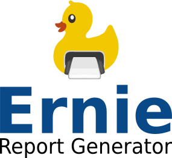

Ernie Report Generator
============================================
Welcome to the alpha release of Ernie, a [high performance](#gatling-performance-testing-) reporting engine. Developers can integrate Ernie using an embedded [Java or Scala API](#embedded-api-), or deploy a [servlet](#ernie-server-) that exposes Ernie's features as a RESTful web service.



Ernie uses a report definition created using the [Eclipse BIRT Designer](http://www.eclipse.org/birt/phoenix/intro/intro03.php). Report definitions specify data sources (any JDBC driver will work), business logic, all presentation markup, and report parameters. Ernie report generation requests specify the output format and report parameter values to apply to a given definition. 

 The following features are supported by all Ernie APIs (ernie-api, ernie-java-api, ernie-server):

*	 managing report definitions and their metadata

*	 creating a report generation job based on a definition

*	 interrogating the status and metadata of a job

*	 managing job output

*	 retrieving lists and catalogs of report generation jobs and definitions

*	specifying an output expiration date and purging expired output

Prerequisites and setup <a id="setup"></a>
----------------------
__Ernie requires the following software:__

1. [Apache Maven 3](http://maven.apache.org/) or [SBT 0.12.4 or better](http://www.scala-sbt.org/)
1. Java 1.6
1. Scala 2.10.1

__To build Ernie with Maven:__

* Without dependencies: 
``` mvn clean install ```
* With dependencies: 
``` mvn clean compile assembly:single ```
* Building a deployable WAR of ernie-server

        cd ernie-server
        mvn clean install

__To build Ernie with SBT:__

* Without dependencies: 
``` sbt compile ```
* With dependencies:
``` sbt assembly ```
* Building a deployable WAR of ernie-server

        clean
        project ernie-server
        package

__To generate ScalaDocs and JavaDocs for all Ernie projects:__

``` mvn scala:doc javadoc:javadoc ```

Find API documentation in /target/site/scaladocs for the Scala projects (ernie-api, ernie-engine, ernie-server, ernie-gatling, ernie-util) and /target/site/apidocs for the Java projects (ernie-model, ernie-java-api).

There are sample maven and sbt projects for ernie-api in the samples directory.

Eclipse BIRT
----------------------
It is recommended that users of Ernie build report definitions with the Eclipse BIRT Designer. A standalone binary is [here](http://www.eclipse.org/downloads/download.php?file=/birt/downloads/drops/R-R1-4_3_0-201306131152/birt-rcp-report-designer-4_3_0.zip). It is also available as a plugin for the Eclipse IDE. The BIRT designer allows report template creation that specifies multiple JDBC data sources and generates complex, graphically rich reports.

The Ernie APIs and server provide endpoints for (CRUD) management of these report definitions. All Ernie report generation tasks take a definition identifier as a required parameter. 

Ernie wraps the BIRT runtime in an Akka ActorSystem and provides a configuration option to limit the number of concurrent report generation tasks. This allows users to asynchronously queue thousands of simultaneous report generation tasks and poll for completion.

Embedded API <a id="api"></a>
---------------
Ernie-api and ernie-java-api are, respectively, Scala and Java interfaces for Ernie-engine. If you are integrating these libraries as standalone jars (with dependencies), please note that they do not include the __BIRT Report Runtime jars which are required to be in your classpath__. The BIRT runtime can be downloaded [here](http://download.eclipse.org/birt/downloads/). Find the requisite jars in ReportEngine/lib.

The embedded APIs provide a builder pattern for configuring Ernie and an engine object that takes a built configuration and produces an interface for interacting with Ernie. For example, using ernie-api:

```scala
val engine = ErnieEngine(api.ErnieBuilder()
	.withMemoryReportManager()
	.withDefaultRetentionDays(7)
	.withMaxRetentionDays(14)
	.withWorkers(100)
.build())
val ernie = e.start
ernie.getDefinitionList
```

Or, using ernie-java-api:

```java
ErnieController ernie = new ErnieController();
ernie.configure(
	new ErnieConfig.Builder(
		new com.ksmpartners.ernie.api.MemoryReportManager()
	)
	.withWorkers(10)
	.build()
);
try {
	ernie.start();
	ernie.getDefinitionList();
```

It is recommended that a single ErnieControl/ErnieController instance service an entire JVM. 
	
For more information on the embedded API configuration and usage, see the [ernie-api](ernie-api) and [ernie-java-api](ernie-java-api) documentation.

Ernie server <a id="server"></a>
-------------------------------

The ernie-server package exposes a RESTful interface to Ernie using the Lift web framework. It supports SAML and Basic authentication with simple, role-based authorization. It also generates a [Swagger](https://developers.helloreverb.com/swagger/) specification and documentation (by default, publicly accessible at /static/docs). The servlet can be tested in a Jetty container:

```
mvn jetty:run -f ernie-server/pom.xml \
	-Dernie.props="./ernie-server/src/main/resources/props/default.props"
```

Once running, navigate to http://localhost:8080/static/docs to view the Swagger UI.

For more information, see the [ernie-server](ernie-server) documentation.

Gatling performance testing <a id="gatling"></a>
---------------------------

Ernie-gatling extends the performance testing DSL of the Gatling stress tool, allowing developers to easily describe scenarios and execute stress tests on either a running ernie-server or the ernie-api. 

On our local development machines, the ErnieApiSimulation found the embedded API able to process around 35000 requests for report output retrieval and 10000 report generation jobs in a total of 3 minutes, with a mean response time of less than 120 ms and over 200 requests per second. The ErnieServerSimulation found the servlet able to serve over 60 requests per second at a mean response time of 20 ms. 

But you don't have to take our word for it. To run the basic simulations bundled with Ernie:

```
#Assumes a running ernie-server at http://localhost:8080

mvn gatling:execute -Dgatling.simulationClass=com.ksmpartners.ernie.ErnieServerSimulation -rf :ernie-gatling

#Standalone performance test of ernie-api

mvn gatling:execute -Dgatling.simulationClass=com.ksmpartners.ernie.ErnieApiSimulation -rf :ernie-gatling

``` 

For more information, see the [ernie-gatling](ernie-gatling) documentation.

TODO
------------------------
Future versions of Ernie will provide:

- [ ] Full SBT support
	- [ ] TestNG
	- [ ] Gatling stress tests
	- [ ] Jetty 
- [ ] Clustered deployment support for embedded API and servlet
- [ ] Swagger client generation for REST server
- [ ] More extensive documentation
- [ ] Push notifications on report generation job status change, via:
	- [ ] Embedded API callbacks
	- [ ] Comet
- [ ] Code coverage working for all packages in Maven and SBT
- [ ] Encryption for rptdesign files with passwords

